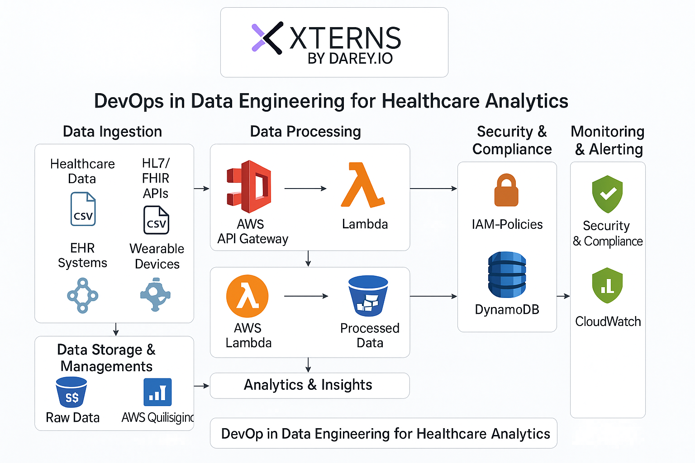

# PulseGrid: DevOps in Data Engineering for Healthcare Analytics

## 📌 Project Overview

**PulseGrid** is a healthcare data analytics project designed to demonstrate the practical implementation of DevOps and data engineering in a real-world healthtech environment. The goal is to build a robust, scalable, cloud-based ETL and analytics pipeline capable of ingesting, processing, and visualizing patient data from multiple sources (EHR systems, wearable devices, CSVs, FHIR APIs).

This project is being delivered by Xterns under the Darey.io platform in collaboration with **HealthTech Innovations**. The solution will provide healthcare providers with real-time, actionable insights, ultimately helping improve patient outcomes through smarter and faster decisions.

---

## 🎯 Objectives

- Design and implement an end-to-end data pipeline for healthcare analytics
- Use DevOps practices to automate infrastructure provisioning, deployments, and monitoring
- Ingest structured and semi-structured health data from multiple sources
- Validate and transform healthcare data using Python
- Deploy the pipeline using modern containerization and CI/CD workflows
- Ensure secure storage, access control, and compliance across the architecture

---

## 📦 What You Will Deliver

- A functioning ETL pipeline that extracts healthcare data from:

  - FTP servers
  - Manual CSV uploads
  - Wearable/FHIR APIs

- Data validation scripts written in Python
- Infrastructure as Code (IaC) templates using Terraform to provision:

  - AWS S3 (for raw and processed data)
  - AWS Lambda (for transformation and processing)
  - AWS API Gateway (to expose endpoints)
  - DynamoDB (for structured patient data)
  - IAM roles and policies

- Dockerfiles and containerized services for data processing
- Kubernetes manifests to manage container orchestration
- CI/CD pipeline setup using ArgoCD
- Logging and monitoring via AWS CloudWatch
- Documentation of the entire architecture and development process

---

## 📚 Technologies & Tools

- **Languages & Frameworks:** Python, Bash
- **Cloud:** AWS (S3, Lambda, API Gateway, DynamoDB, CloudWatch)
- **Infrastructure:** Terraform
- **Containers & Orchestration:** Docker, Kubernetes
- **CI/CD:** ArgoCD
- **Standards:** HL7, FHIR (where applicable)

---

## ✅ Success Criteria

- All data sources ingested and validated successfully
- Infrastructure provisioned via Terraform and reproducible
- CI/CD pipeline operational with auto-deployments to Kubernetes
- Real-time monitoring and alerts enabled
- All code and scripts stored in a well-organized GitHub repo with clear documentation
- Each Xtern has submitted their contributions through Git commits and portfolio updates
